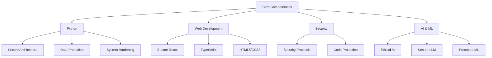

# kleosr

<div align="center">
  
  <p>
    <em>"The integrity of the upright guides them, but the unfaithful are destroyed by their duplicity." - Proverbs 11:3</em>
  </p>
  <p>
    <a href="https://github.com/kleosr"></a>
    <a href="https://forum.cursor.com/u/kleosr/summary"></a>
  </p>
</div>

<div align="center">


```ascii
    ╔════════════════════════════════════════════════════════════════════════════╗
    ║                                                                             ║
    ║  ⚡  Full-Stack Architect | 🔒 Security Guardian | 🐍 Python Virtuoso     ║
    ║  🌐  Web Artisan | 💻 Frontend Craftsman | 🧠 Neurodivergent Engineer    ║
    ║  📖  Biblical Scholar | 🌟 Open Source Steward | 🎮 Digital Alchemist    ║
    ║                                                                             ║
    ╚════════════════════════════════════════════════════════════════════════════╝
```


</div>

## 🎯 Mission Statement

> "The Lord is my light and my salvation—whom shall I fear? The Lord is the stronghold of my life—of whom shall I be afraid?" - Psalm 27:1

Dedicated to fortifying digital systems through ethical security practices and principled code architecture. Our mission is to protect and serve through responsible technology stewardship.

## 🚀 Current Focus

- 🔭 **Primary Project**: NAEGIA Obfuscator - Enterprise-Grade Code Protection
- 🌱 **Advanced Studies**: 
  - Secure React Architecture & Design Patterns
  - Security Protocols & System Hardening
  - Biblical Ethics in Software Development
- 👯 **Community**: Cursor Forum Security Advisory & Mentorship
- 🤔 **Research**: Secure Performance Optimization
- 💬 **Expertise**: Secure Full-Stack Architecture, Python Security, System Protection

## 🛠️ Technical Arsenal



## 🌐 Digital Presence

<div align="center">
  <a href="https://kleosr.surge.sh">
    
  </a>
</div>

## 📊 Development Metrics

<div align="center">
  
</div>

## 📫 Network

<div align="center">
  <a href="https://github.com/kleosr"></a>
  <a href="https://forum.cursor.com/u/kleosr/summary"></a>
</div>

## ⚡ Core Principles

- 🎯 Ethical Development Philosophy
- 🛡️ Security-First Architecture
- 💻 Clean Code Standards
- 🌟 Excellence in Security
- 🎨 Secure UI/UX Design
- 📖 Biblical Ethics in Technology 
