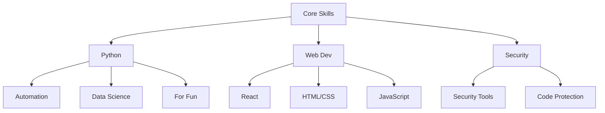

# kleosr

<div align="center">
  
  <p>
    <em>Full-Stack Developer | Security Enthusiast | Python Expert | Web Craftsman</em>
  </p>
  <p>
    <a href="https://github.com/kleosr"></a>
    <a href="https://forum.cursor.com/u/kleosr/summary"></a>
  </p>
</div>

<div align="center">
## 🎯 About Me

```ascii
    ╔════════════════════════════════════════════════════════════════════════════╗
    ║                                                                             ║
    ║  🛡️  Full-Stack Developer | 🔒 Security Enthusiast | 🐍 Python Expert     ║
    ║  🌐  Web Craftsman | 💻 Frontend Specialist | 🧠 ADHD-Friendly Coder     ║
    ║  📖  Bible Lover | 🌟 Open Source Contributor | 🎮 Tech Enthusiast      ║
    ║                                                                             ║
    ╚════════════════════════════════════════════════════════════════════════════╝
```
</div>

## 🚀 Current Focus

- 🔭 **Working On**: NAEGIA Obfuscator & Personal Website
- 🌱 **Learning**: Advanced React Patterns & Web Security
- 👯 **Collaborating**: Cursor Forum Projects
- 🤔 **Seeking Help**: Web Performance Optimization
- 💬 **Ask Me About**: Web Dev, Python, or Life Balance

## 🛠️ Tech Stack



## 🌐 My Website

<div align="center">
  <a href="https://kleosr.surge.sh">
    
  </a>
</div>

## 📊 GitHub Stats

<div align="center">
  
</div>

## 📫 Connect With Me

<div align="center">
  <a href="https://github.com/kleosr"></a>
  <a href="https://forum.cursor.com/u/kleosr/summary"></a>
</div>

## ⚡ Fun Facts

- 🎯 ADHD-friendly coding practices
- 🛡️ White hat security enthusiast
- 💻 Built with ❤️ and Python
- 🌟 Making the world more secure, one commit at a time
- 🎨 Love crafting beautiful web experiences
- 📖 Bible verses inspire my code 
